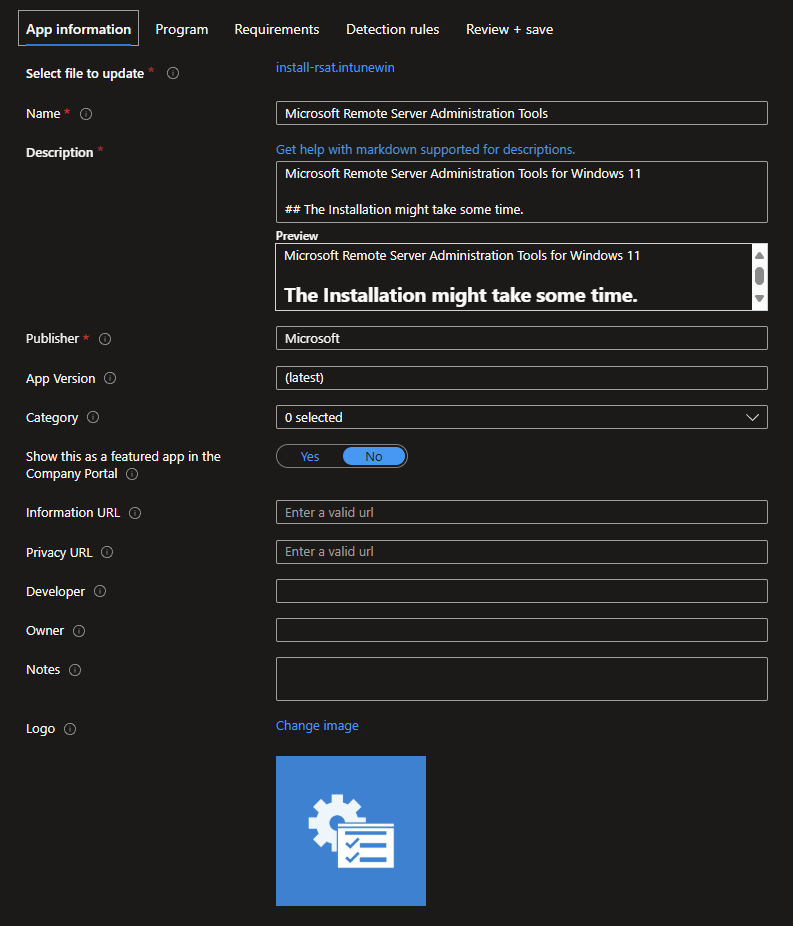
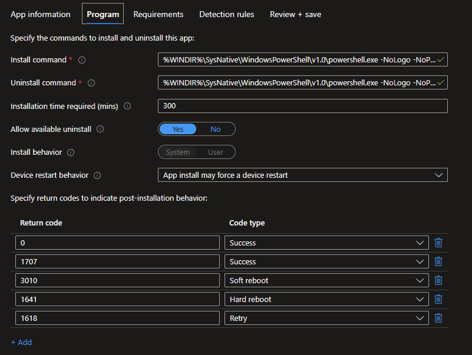
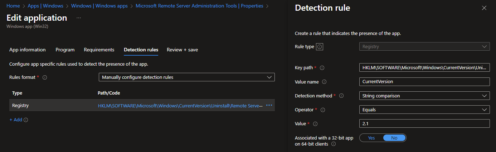

# 👨‍💻 Intune Windows RSAT 👨‍💻

This repo contains a script to deploy the Windows RSAT tools using `.cab` files to Windows 11 clients.

## Prerequisites
Download the current `mul_languages_and_optional_features_for_windows_11` ISO (available in MSDN), containing the `.cab` files for optional features and languages.
Copy the following files for the language (in this example `en-us`) that you want to deploy into the package folder and create a `.INTUNEWIN` file with them and the `.ps1` script:
- Microsoft-AzureStack-HCI-Management-Tools-FOD-Package-`en-us`.cab
- Microsoft-Windows-ActiveDirectory-DS-LDS-Tools-FoD-Package-`en-us`.cab
- Microsoft-Windows-BitLocker-Recovery-Tools-FoD-Package-`en-us`.cab
- Microsoft-Windows-CertificateServices-Tools-FoD-Package-`en-us`.cab
- Microsoft-Windows-DHCP-Tools-FoD-Package-`en-us`.cab
- Microsoft-Windows-DNS-Tools-FoD-Package-`en-us`.cab
- Microsoft-Windows-FailoverCluster-Management-Tools-FOD-Package-`en-us`.cab
- Microsoft-Windows-FileServices-Tools-FoD-Package-`en-us`~.cab
- Microsoft-Windows-GroupPolicy-Management-Tools-FoD-Package-`en-us`.cab
- Microsoft-Windows-IPAM-Client-FoD-Package-`en-us`.cab
- Microsoft-Windows-LLDP-Tools-FoD-Package-~.cab
- Microsoft-Windows-NetworkController-Tools-FoD-Package-`en-us`.cab
- Microsoft-Windows-NetworkLoadBalancing-Tools-FoD-Package-`en-us`.cab
- Microsoft-Windows-RemoteAccess-Management-Tools-FoD-Package-`en-us`.cab
- Microsoft-Windows-RemoteDesktop-Services-Tools-FoD-Package-`en-us`.cab
- Microsoft-Windows-ServerManager-Tools-FoD-Package-`en-us`.cab
- Microsoft-Windows-StorageMigrationService-Management-Tools-FOD-Package-`en-us`.cab
- Microsoft-Windows-StorageReplica-Tools-FoD-Package-`en-us`.cab
- Microsoft-Windows-SystemInsights-Management-Tools-FOD-Package-`en-us`.cab
- Microsoft-Windows-VolumeActivation-Tools-FoD-Package-`en-us`.cab
- Microsoft-Windows-WSUS-Tools-FoD-Package-`en-us`.cab

## Deployment
Create a `.INTUNEWIN` containing the `install-rsat.ps1` and all `.cab`-files. Then create a new Intune App from it: 


### Install
``` powershell
%WINDIR%\SysNative\WindowsPowerShell\v1.0\powershell.exe -NoLogo -NoProfile -NonInteractive -WindowStyle Hidden -ExecutionPolicy Bypass -File "install-rsat.ps1" -install
```

### Uninstall
``` powershell
%WINDIR%\SysNative\WindowsPowerShell\v1.0\powershell.exe -NoLogo -NoProfile -NonInteractive -WindowStyle Hidden -ExecutionPolicy Bypass -File "install-rsat.ps1" -uninstall
```

<span style="color:cornflowerblue;font-weight:bold">🛈  HINT</span><br/>
    The installation might take some time so make sure to ensure a long-enough timeout. 


### Detection
Build the Intune detection on the Registry key: `HKLM\SOFTWARE\Microsoft\Windows\CurrentVersion\Uninstall\Remote Server Administration Tools` and check the value `CurrentVersion` to match the version that you selected for install



Made with ❤️ by [Niklas Rast](https://github.com/niklasrst)


